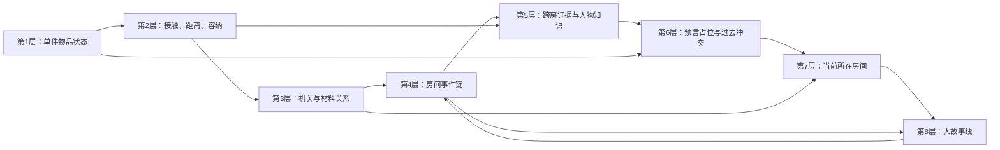
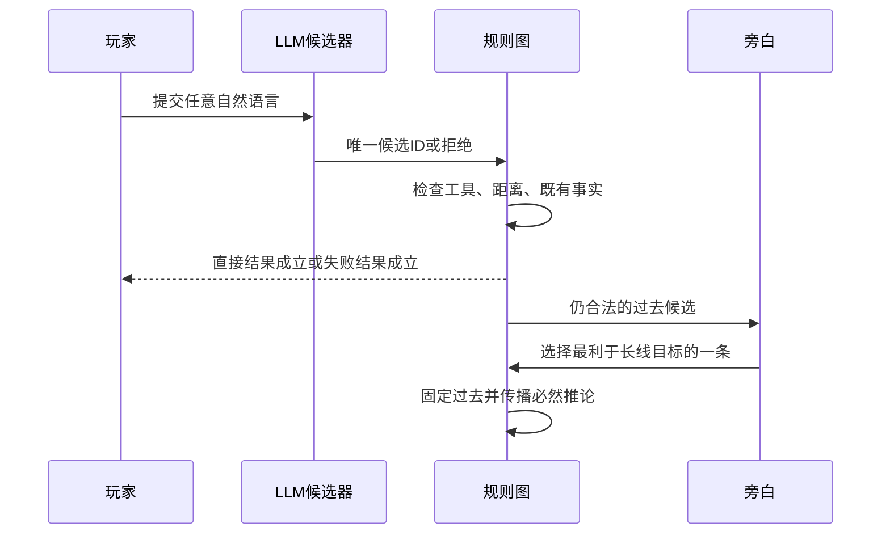

# 时间关系图

```mermaid
flowchart LR
  L1["第1层：单件物品状态"] --> L2["第2层：接触、距离、容纳"]
  L2 --> L3["第3层：机关与材料关系"]
  L3 --> L4["第4层：房间事件链"]
  L4 --> L5["第5层：跨房证据与人物知识"]
  L5 --> L6["第6层：预言占位与过去冲突"]
  L6 --> L7["第7层：当前所在房间"]
  L7 --> L8["第8层：大故事线"]
  L1 --> L6
  L2 --> L5
  L3 --> L7
  L4 --> L8
  L8 --> L4
```

```mermaid
sequenceDiagram
  participant P as 玩家
  participant M as LLM候选器
  participant R as 规则图
  participant N as 旁白
  P->>M: 提交任意自然语言
  M->>R: 唯一候选ID或拒绝
  R->>R: 检查工具、距离、既有事实
  R-->>P: 直接结果成立或失败结果成立
  R->>N: 仍合法的过去候选
  N->>R: 选择最利于长线目标的一条
  R->>R: 固定过去并传播必然推论
```

游戏界面的关系图直接读取同一个 `FactGraph`，只显示已经揭示的节点。过去为蓝色，当前/推论为黄色，必然未来为红色。完整的5906项属性卷和时间边位于 `world-data.js`。
